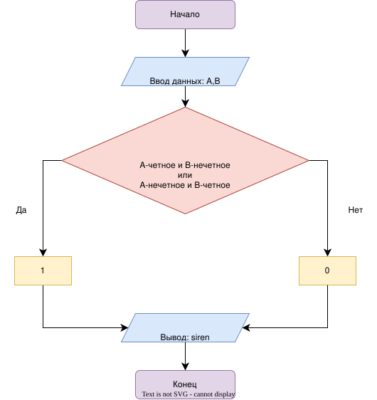

# Домашнее задание

## Условие задачи
Прибор на заводе имеет две контрольные лампы, соответствующие значениям датчиков A и B. Сирена тревоги должна загораться, если ровно одна из ламп показывает нечетное значение. Запишите условие для включения сирены.

---

## 1. Алгоритм и блок-схема

### Алгоритм
1. **Начало.**
2. **Задать исходные данные:**
   * `A` — целое число
   * `B` — целое число
3. **Проверка условия:**
   * `((A % 2 != 0 и B % 2 == 0) или (A % 2 == 0 и B % 2 != 0))`.
4. **Вывод результата:**
   * Вывести значение `siren` на экран (1 — сирена включена, 0 — выключена).
5. **Конец.**

### Блок-схема

[](https://viewer.diagrams.net/?tags=%7B%7D&lightbox=1&highlight=0000ff&edit=_blank&layers=1&nav=1&dark=auto#R%3Cmxfile%3E%3Cdiagram%20id%3D%22RVlEhpF2mz6wUNssJ0yM%22%20name%3D%22%D0%A1%D1%82%D1%80%D0%B0%D0%BD%D0%B8%D1%86%D0%B0-1%22%3E7VpNl6I4FP01LvXwDS4tdWq6Z6pPn6lFTy8jRMx0IEyIX%2FPrJ5BECKilFpR9umpRFHlJHvHdvPsu0YE9TXaPFGSrJxJBPLCMaDewZwPLMh3T4P8Ky15ZHEdYYooiaasMz%2Bg%2FKI1yYrxGEcy1gYwQzFCmG0OSpjBkmg1QSrb6sCXB%2BlMzEMsnGpXhOQQYtoZ9QxFbCWtg%2BZX9d4jilXqy6Y1FTwLUYOk4X4GIbGsmez6wp5QQJu6S3RTiInoqLmLebyd6DwujMGWXTBguvk3%2FePw0%2F%2FwZ7uAXumD4x9MwEF5gFDc%2Fb%2BVWmnKypiE840uNY3sVvMLts2ymJOX%2FHsI13cBiRSZvULJOo7JlqK5HSBLI6F6OIJStSExSgP8kJJPGfyBje7lVwJoRblqxBMtevm66%2F7vwOXJV87t8RNmY7bTWXraWJGXSqcnBecgZoMoQlKOjWktuRUBjyM7ExD8AzVNEfTTLoBADhjZ6zIHcqvFhXIUmv5GAXgHuGSwrjCoMiuBtV4jB5wyUQG95TuuxlYO%2FQor4EiGV5iXCeEowoaVLG5qRC%2F0yhJT8gLWesefbwDuEbwPwWi5jYHmYSRS0BXr%2FronqGOYlABM%2BwPSyXelH9fO7uPzPwRzPiuuDMeCrC3x1z69l78NcPYxHVTxPThWLgpTBXS1cbfhWtYx3ZHpvK3YwlU16GdquNEgWHHqB0RPm1rvFfCKxLa4Cf7fE37s72qbXF9qm3yF%2F2x%2F8fTyd7sXf9iW5zGVFVtzyUQBjiElMQcI%2FYFbLV62vlsgvpX7p%2B1Oacwl2yPodVGE8wgIRgMEyPMYCXhjAxbJ%2FFrDKnBc8b9UYwRGTc8Rj2TchBE1C8BuEcJjVPSGYHRKCc5YQqtSeV9YGJdyQ%2Fr2ksffKNC6nTigF%2B9qAjKCU5TXPXwtDDfegAbvjug2AhcsK7oo9b98BXUr6u%2ByAn6oAuFfsHIm7MTIM2%2B96Mzl32U3ORXJyRZLFOr%2Btnmj1YwmiceQeqx8AOqZtnasfEdqcLh9LkCC8FzXgCaaYDKxpccs3Zijv%2BQyQFAuW86Y8ORCvkpbxBW6bnWJKQlKSi0%2FLLQZGKRyq4lCWqkCWKqMMzFCOLboyCo8Xsa6q4WRYe%2FsRStiqaeO5tFvixYiThvEwbGnnF2fLqKSLPKstvlVYD%2BYSJN36gVtLxXA4qrfV4CPK%2FWTHtXtdz5SLsuManG4Qn6bbVp%2B2449cXX86rj3yXb16uHZvEtTqUIC49xUgmvyo1EgnAgSjBdgQFP1F1gylsXz2hbLEvougbWmQxplzPxrEvUiDaKC%2FoEOaqmO5tMKjb62Rt%2FDcfs%2BuzJ7fRpsvo67VwNC2%2BmIC75cGznhj4My3A27cIYP7Zxn8fZ4qOq9k71eB65%2FG8uNU8fSpYus8UepBp%2Fb10kxdxREkv7rCO%2F%2Bbntbtb3Xs6Bm9aT6vQ8bw7qH5utBucIdYjWJ463utpyKYoqH4pQe9p%2FA3Rn4QjLvWgFdJwPb0w7dlhy%2FH%2FMamFPtDzqscH3HlNZfSfKcRYW256uyodXwJlfK0ZvpeO8aPOrXJsljnQWkCGMUpb4b8iSXZFsSBQoAnsiNBUXQkJXomSMWCHVKc3aY4r6llm5vJ6Y3hqp8HvXusZ9qxx9si3ixptwDOm9WvrgQXVD9es%2Bf%2FAw%3D%3D%3C%2Fdiagram%3E%3C%2Fmxfile%3E)
## 2. Реализация программы
```c
#include <stdio.h>

int main() {
    int A, B;
    int siren;

    printf("=== СИСТЕМА КОНТРОЛЯ ДАТЧИКОВ ===\n");
    printf("Введите значения датчиков (A и B): ");

    scanf("%d %d", &A, &B);
    siren = ((A % 2 != 0 && B % 2 == 0) || (A % 2 == 0 && B % 2 != 0));

    printf("Включение сирены (1 - да, 0 - нет): %d\n", siren);

    return 0;
}
```
## 3. Результат работы программы
=== СИСТЕМА КОНТРОЛЯ ДАТЧИКОВ ===
Введите значения датчиков (A и B): 4 7
Включение сирены (1 - да, 0 - нет): 1

=== СИСТЕМА КОНТРОЛЯ ДАТЧИКОВ ===
Введите значения датчиков (A и B): 7 7
Включение сирены (1 - да, 0 - нет): 0
## 4. Информация о разработчике
Гаврилова Анна, бИД-262
